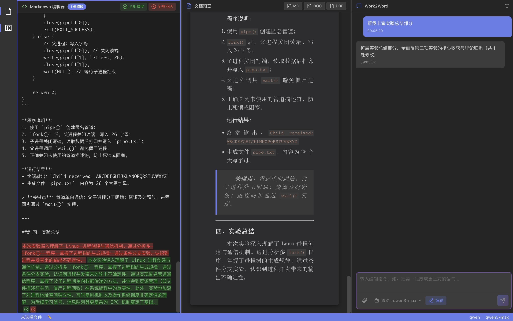
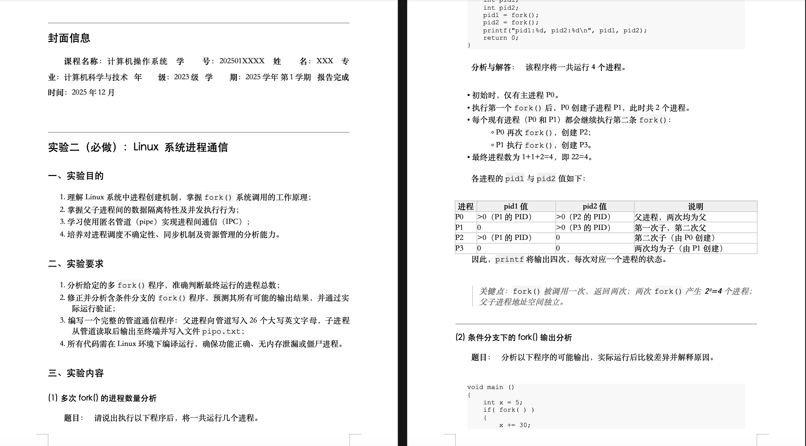

<p align="center">
  <a href="https://www.getzep.com/">
    
  </a>
</p>


<h1 align="center">
  Work2Word
</h1>

一个简洁美观的跨平台AI应用程序，用Markdown编辑文本，Word渲染，支持导出word、pdf、md。可根据上传文件和提示词生成和编辑md文本。软件开发的起因是大学时不仅要写一大堆的报告、还要不断调整Word格式，为提高效率，遂开发此软件。

> [!TIP]
> 目前还需要自行配置api开启AI对话功能。

## 界面展示


（整个文档内容均为AI生成）

## 安装

### 本地部署
```bash
git clone https://github.com/CliPg/Work2Word.git
npm install
npm run dev
```
构建应用
```bash
# 构建前端和 Electron
npm run build

# 打包为 macOS 应用
npm run package:mac

# 打包为 Windows 应用
npm run package:win

# 同时打包 macOS 和 Windows
npm run package:all
```

### Mac下载
右侧release提供安装dmg

### Windows下载
右侧release提供安装exe


## 项目结构

```
electron/
├── main.ts                 # 主进程入口
├── preload.ts              # 预加载脚本
├── types.d.ts              # 类型声明
├── services/               # 服务层
│   ├── index.ts            # 服务导出
│   ├── fileService.ts      # 文件读取服务
│   ├── llmService.ts       # LLM 调用服务
│   └── exportService.ts    # 导出转换服务
├── utils/                  # 工具函数
│   ├── index.ts            # 工具导出
│   ├── markdownParser.ts   # Markdown 解析
│   └── latexConverter.ts   # LaTeX 转换
└── types/                  # 类型定义
    └── index.ts            # 类型导出

src/
├── main.tsx                # React 入口
├── App.tsx                 # 主组件
├── App.css                 # 主样式
├── index.css               # 全局样式
├── electron.d.ts           # Electron API 声明
├── components/             # UI 组件
│   ├── index.ts            # 组件导出
│   ├── editor/             # 编辑器相关
│   │   ├── MarkdownEditor.tsx
│   │   └── MarkdownEditor.css
│   ├── preview/            # 预览相关
│   │   ├── WordPreview.tsx
│   │   └── WordPreview.css
│   ├── sidebar/            # 侧边栏相关
│   │   ├── Sidebar.tsx
│   │   └── Sidebar.css
│   ├── settings/           # 设置相关
│   │   ├── FormatSettings.tsx
│   │   ├── FormatSettings.css
│   │   ├── LLMConfig.tsx
│   │   └── LLMConfig.css
│   └── common/             # 通用组件
│       ├── FileUpload.tsx
│       ├── FileUpload.css
│       ├── PromptInput.tsx
│       ├── PromptInput.css
│       ├── ResultDisplay.tsx
│       └── ResultDisplay.css
└── hooks/                  # 自定义 Hooks（未来扩展）
    └── index.ts
```


## 功能特性

- 📄 **多格式文件支持**：支持 DOC、DOCX、PDF、TXT 格式的作业附件
- ✍️ **智能作业处理**：输入作业要求，AI 自动完成作业内容
- 🤖 **多 LLM 支持**：支持通义千问 (Qwen)、OpenAI 和自定义 API
- 📝 **多格式导出**：支持导出为 Markdown、Word 文档和 PDF 格式
- 🎨 **简洁美观的界面**：现代化的 UI 设计，提供流畅的用户体验
- 💻 **跨平台支持**：同时支持 macOS 和 Windows 系统
- 🚀 **AI编辑**：支持AI文本编辑

## 技术栈

- **前端**：React + TypeScript + Vite
- **桌面框架**：Electron
- **文件处理**：mammoth (Word)、pdf-parse (PDF)
- **格式转换**：docx (Word 生成)、puppeteer (PDF 生成)
- **Markdown 渲染**：react-markdown


## LLM 配置

### 通义千问 (Qwen)

1. 在"提供商"下拉框中选择"通义千问 (Qwen)"
2. 输入您的 API Key（可在阿里云 DashScope 获取）
3. 选择模型（默认：qwen-turbo）

### OpenAI

1. 在"提供商"下拉框中选择"OpenAI"
2. 输入您的 OpenAI API Key
3. 选择模型（默认：gpt-3.5-turbo）

### 自定义 API

1. 在"提供商"下拉框中选择"自定义 API"
2. 输入 API URL 和 API Key（如需要）
3. 输入模型名称


## 功能特性详解

### 文件处理
- **Word 文档 (DOC/DOCX)**: 使用 mammoth 库提取文本内容
- **PDF 文档**: 使用 pdf-parse 库提取文本内容
- **文本文件 (TXT)**: 直接读取 UTF-8 编码内容

### LLM 集成
- **通义千问**: 支持 DashScope API，默认模型 qwen-turbo
- **OpenAI**: 支持 GPT 系列模型，默认 gpt-3.5-turbo
- **自定义 API**: 支持自定义 API 端点，灵活配置

### 格式转换
- **Markdown**: 直接保存为 .md 文件
- **Word 文档**: 使用 docx 库生成 .docx 文件，支持标题、粗体、斜体等格式
- **PDF 文档**: 使用 Puppeteer 将 Markdown 渲染为 HTML 后转换为 PDF

## To Be Expected

- 文档中插入图片
- 
